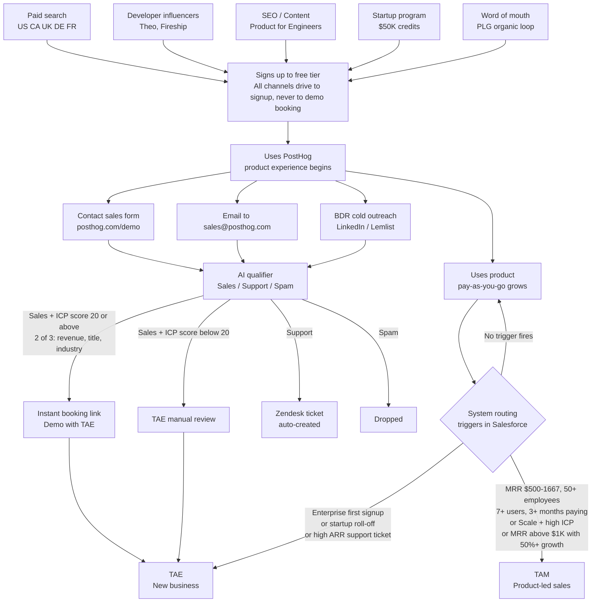
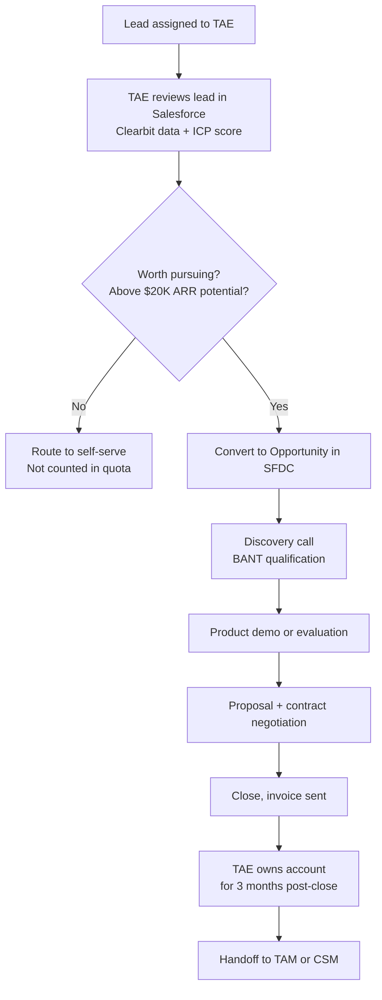
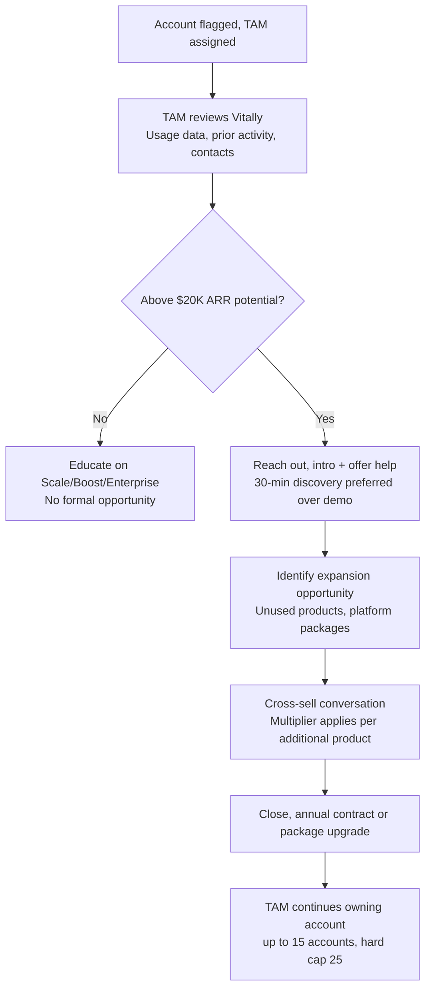

# Acquisition and Upsell Funnel

This document maps how PostHog generates demand, how that demand splits between self-serve and sales-led motions, how each motion qualifies and routes leads, and where the attribution problem between product and rep first appears.

## 1. How Demand Is Generated

PostHog demand comes from two fundamentally different sources that operate in parallel and are often impossible to separate.

### Intentional Demand (Marketing)

Charles Cook owns marketing and demand generation. The philosophy is explicitly anti-demo and anti-sales-led: the handbook states that running campaigns to generate demo bookings for sales is "a waste of time" because the product is built for customers to buy without ever speaking to anyone.

Every marketing channel has a single goal: get an engineer to sign up and try the product, not book a sales call.

| Channel | Goal | Lead Source in Salesforce |
|---|---|---|
| Paid search (Google) | Signups in US, CA, UK, DE, FR. Budget split 50/50 between awareness and conversion. Managed by an external agency. | Paid Search |
| Developer influencers | Sponsorships with Theo, Fireship, and others. High variance but strong results when it works. | Referral / Influencer |
| SEO and technical content | Blog posts, tutorials, comparisons, docs. Targets engineers searching for analytics, session replay, feature flags, and observability tools. | Organic Search |
| YouTube | Product demos, engineering content, founder interviews. | YouTube |
| Product for Engineers newsletter | 20K+ subscribers. Drives awareness and adoption, not pipeline directly. | Newsletter |
| Startup program | $50K in PostHog credits. Partners include Stripe Atlas, VC firms, and accelerators. Creates a cohort of early-stage companies that may grow into large accounts. | Startup Program |
| Billboards | Brand awareness in ICP markets. Not conversion-focused. | Direct / Brand |
| Co-marketing and events | Partnerships with integration vendors, IRL events, virtual events. | Partner / Event |

**The marketing team runs a monthly growth review with Charles Cook** covering paid and organic funnel performance. This review exists for marketing but there is no equivalent for sales-led revenue. That gap is what the RevOps role fills.

### Organic Demand (Product)

The majority of PostHog's 450K+ installs came from word-of-mouth, not marketing. An engineer installs PostHog, uses it, recommends it to another team, and that team recommends it to another company. This loop generates demand that marketing does not create and cannot fully measure.

**The attribution problem starts here.** When a company signs up because an engineer recommended it, the Lead Source in Salesforce says "organic" or "direct" but the real origin is a product experience that happened elsewhere. Marketing cannot claim credit. Sales cannot claim credit. The product generated the lead.

## 2. How Demand Reaches the Commercial Team

Every company enters the same free tier regardless of how they found PostHog. What determines whether a human rep ever touches the account is a combination of behavior, company profile, and whether the account actively requests contact.

## 3. Routing Criteria

### Product-led Sales Team (TAM)

Accounts already paying and showing expansion signals. The system automatically routes when any of these conditions are met:

| Criteria | Threshold |
|---|---|
| Usage + firmographic match | MRR $500 to $1,667 AND employees above 50 AND users above 7 AND ICP country AND paying for 3+ months |
| High ICP score on Scale plan | Scale plan subscriber with high ICP score |
| High MRR with spend acceleration | MRR above $1K AND forecasted spend increase above 50% this month |
| High ARR support ticket | Unmanaged account with above $20K ARR that raises a support ticket |

### New Business Sales Team (TAE)

Accounts earlier in the lifecycle, not yet paying or just starting. Routes on:

| Criteria | Description |
|---|---|
| Demo form completed | Organic inbound, paid ads, or outbound |
| Onboarding specialist referral | Internal handoff from onboarding team |
| Enterprise first signup | First signup from 500+ employee company with 1+ event ingested and 1+ person invited |
| Startup credit burndown | Used 50%+ of startup credits AND last invoice above $5K |
| Startup plan roll-off (high) | Rolling off startup plan in ~100 days AND last invoice $2K to $5K |
| Startup plan roll-off (medium) | Rolling off startup plan in ~2 months AND last invoice above $1.5K |
| AE named lists | Manually curated target accounts |
| Direct email to sales@ | Anyone who emails sales directly |

### BDR Team (Outbound)

The BDR team runs outbound campaigns tracked in Lemlist. Current focus: Engineering Managers (VPs, Directors, Heads of) who follow PostHog on LinkedIn but are not customers, website intent signals, and competitor takeouts.

Backlog campaigns include high Stripe spenders with low PostHog MRR, churned opportunities 5+ months old, and companies with recent fundraising activity.

**Manual referrals:** Anyone at PostHog can flag an account as high potential by adding a Segment in Vitally. `AM referral` for product-led sales or `AE referral` for new business.

## 4. The Lead Scoring Model

PostHog calculates a lead score in Salesforce (separate from the ICP score, which is marketing-aligned) to prioritize the inbound book of business. Data is enriched via Clearbit.

Score ranges from 0 to 70 points.

| Dimension | Value | Points |
|---|---|---|
| Employee count | 1 to 10 | 0 |
| | 11 to 1,000 | 10 |
| | 1,000+ | 20 |
| Ability to pay (estimated revenue) | $0M to $1M | 0 |
| | $1M to $10M | 5 |
| | $10M to $100M | 10 |
| | $100M+ | 20 |
| Role | Engineering | 10 |
| | Product | 10 |
| | Leadership / Founder | 10 |
| | Marketing | 5 |
| | Other | 0 |
| Sub-role | Software / Web / Project / Data Science engineer | 10 |
| | Founder / CEO | 10 |
| | Other | 0 |
| Country | Austria, Canada, France, Germany, Japan, Norway, Sweden, UK, USA | 10 |
| | Australia, Belgium, Estonia, Finland, Georgia, Guernsey, Netherlands, NZ, Poland, Portugal, Singapore | 5 |
| | Other | 0 |

Target conversion rate from scored leads: ~20%

Demo booking threshold: Accounts with ICP score of 20 or above that match 2 of 3 requirements (revenue, title, industry) get an instant booking link. Below 20, the TAE reviews manually.

## 5. The New Business Funnel (TAE)

Once a lead is routed to the new business team:

Key rules. Minimum deal size to work is $20K ARR. Below this, the TAE routes to self-serve. TAE quota is based on dollars invoiced, not credits or face value of discounted deals. Commission is paid quarterly when the customer pays their invoice. Discounts above defined levels require approval from Ben (TAEs/TAMs) or Simon (CSMs), otherwise the deal does not count toward quota. Early renewal discount of +5% is available if the customer commits to renewal before credits expire.

## 6. The Product-led Sales Funnel (TAM)

Once a paying account is routed to the product-led sales team:

Cross-sell multiplier on TAM quota: 1 product at 0.7x, 2 products at 0.9x, 3 products at 1.1x, each additional product adds 0.2x.

A TAM closing a multi-product expansion earns a higher effective commission rate than a single-product renewal. The incentive structure explicitly rewards breadth of adoption.

Key challenge: getting happy self-serve customers to engage with a TAM is difficult by design, they don't feel like they need help. The handbook acknowledges this and provides specific tactics for getting customers to take the first call.

Credit for the deal: the TAM must demonstrate concrete sales activity. "A couple of emails and 1 call" does not count. The Revenue Leader makes the final call on whether activity is sufficient to include the deal in the book of business.

## 7. Handoff Points and Failure Modes

| Handoff | From / To | Risk |
|---|---|---|
| Post-close handoff | TAE to TAM | TAE owns for 3 months then hands off. If the TAM is not briefed properly, the customer loses context and feels abandoned. |
| Product-led trigger | System to TAM | Automated routing can assign a TAM to an account that already has a relationship with someone else at PostHog. Handbook explicitly says to check Vitally before reaching out. |
| Startup roll-off | System to TAE | Customers rolling off startup credits are time-sensitive. A delayed reach-out means the customer hits pay-as-you-go rates and churns before ever talking to sales. |
| Support ticket escalation | Support to TAM | Unmanaged accounts with above $20K ARR that raise a support ticket get routed to a TAM but the transition from support context to sales context requires care to avoid feeling like a bait-and-switch. |

## 8. What This Means for RevOps

**Pipeline leakage is invisible today.** There is no documented system for alerting when a high-value lead goes cold, when a startup roll-off account is approaching without a TAE touch, or when a product-led trigger fires but the TAM does not act within a defined SLA. These are the alerts the JD explicitly asks for.

**The 20% conversion target has no tracking infrastructure.** The handbook states a target conversion rate of ~20% from scored leads but there is no documented dashboard or cadence for measuring this. A weekly or biweekly update tracking lead-to-opportunity conversion by lead source and score band would give the team a leading indicator before the monthly growth review.

**The attribution problem is unresolved by design.** When a TAM touches a product-led account that was already growing organically, the quota model credits the TAM for incremental ARR but does not measure what the account would have grown to without intervention. Designing a holdout or quasi-experimental framework to measure TAM incrementality is the cleanest way to validate whether the product-led sales motion generates lift beyond organic growth.

**Vitally and Salesforce are partially synced, not fully integrated.** Email from Vitally requires a manual BCC to sync to Salesforce. Slack channel activity syncs via Pylon but only when the integration is correctly set up. Any gap in sync means the customer history is fragmented and a rep walking into a conversation blind is a real risk.

**Manual referrals are an underused signal.** Any PostHog employee can flag a Vitally record as AM referral or AE referral. This is a high-quality signal because it comes from someone with direct product or customer knowledge but there is no reporting on how many manual referrals are generated, what their conversion rate is compared to automated triggers, and whether certain teams generate better referrals than others.

## Sources

- [posthog.com/careers](https://posthog.com/careers) — "More than 450,000 organizations have installed PostHog, mostly driven by word-of-mouth"
- [Lead routing and scoring](https://posthog.com/handbook/growth/sales/lead-scoring) — TAM routing thresholds (MRR $500 to $1,667, 50+ employees, 7+ users, 3+ months paying) and "Generally you should be aiming for a 20% conversion rate from these types of leads"
- [New business how we work](https://posthog.com/handbook/growth/sales/new-business-how-we-work) — TAM book size (up to 15 accounts, hard cap of 25 including incoming leads)
- [Product-led sales](https://posthog.com/handbook/growth/sales/product-led-sales)
- [Managing our CRM](https://posthog.com/handbook/growth/sales/crm)
- [RevOps overview](https://posthog.com/handbook/growth/revops/overview)
- [Marketing overview](https://posthog.com/handbook/marketing)
- [Paid ads](https://posthog.com/handbook/marketing/paid)