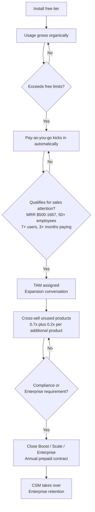

# PostHog Product Structure and Sales Model

## The Business Model in One Sentence

PostHog charges based on usage, not seats or MTUs, with a generous free tier that resets monthly, automatic pay-as-you-go billing once limits are exceeded, and three platform packages sold commercially for teams that need governance, compliance, and enterprise controls.

## The Key Insight Before Anything Else

**PostHog does not have sales-only products.** Every product is self-serve by design. What the commercial team sells is not access to products. It is:

1. Annual contracts with upfront credit purchases and volume discounts
2. Platform packages (Boost, Scale, Enterprise) that unlock governance features the free tier does not include
3. Multi-product expansion — identifying which products a paying customer has not yet activated and closing the cross-sell

This means the attribution problem is structural: any revenue the commercial team generates exists on top of what the product would have generated organically. The comp model does not cleanly separate these today.

## The 15 Products

| Product | Billing metric | Free tier | Primary users | Commercial trigger |
|---|---|---|---|---|
| Product Analytics | Events | 1M events/month | PMs, engineers | Volume above 1M/month, data retention above 1yr, compliance |
| Web Analytics | Shared with Analytics events | Shared | Marketing | Bundle with Analytics |
| Session Replay (web) | Recordings | 5K/month | PMs, engineers, support | Volume above 15K/month, retention above 90 days |
| Session Replay (mobile) | Recordings | 2.5K/month | Mobile engineers | 2x web pricing escalates fast at scale |
| Feature Flags | Requests | 1M requests/month | Engineers, PMs | RBAC on flag management, audit logs |
| Experiments | Billed under Feature Flags | Same as Feature Flags | PMs, growth | Same as Feature Flags |
| Surveys | Responses | 1.5K responses/month | PMs, CS | NPS programs at scale, identified user linking |
| Managed warehouse | Rows synced | 1M rows/month | Data teams, analysts | Large CRM/billing syncs — strong commercial signal |
| Data Pipelines | Trigger events / rows | 10K triggers or 1M rows/month | Data engineers | High-volume streaming to data warehouses |
| Error Tracking | Exceptions | 100K/month | Engineers | Bundle with Session Replay and AI Observability |
| AI Observability | Events | 100K/month | AI engineers | Teams shipping AI features at scale |
| PostHog AI | Credits | 500 credits/month | PMs, analysts | Heavy daily use by large teams |
| Workflows | Emails / dispatches | 10K/month per channel | Growth, marketing | Lifecycle programs replacing Braze or Iterable |
| Logs | GB ingested | 50GB/month | Engineers, DevOps | High-volume production systems |
| Inbox (Beta) | PRs | 3 PRs/month | Engineers | Experimental, not a material revenue driver yet |

> **Note:** Experiments share the Feature Flags billing meter. An experiment evaluating 500K users consumes 500K feature flag requests with no separate charge.

> **Add-on:** Group Analytics ($0.000071/event after 1M free) enables event tracking at the company level rather than the individual user level. Relevant for B2B accounts with multiple users — a TAM signal worth monitoring. Accounts that activate Group Analytics are signaling organizational complexity that correlates with larger, stickier contracts.

## Product Detail and Upsell Logic

### Product Analytics
Tracks user events and behavior. Funnels, retention, cohorts, user paths, custom dashboards. The core product most customers install first. Identified events (with person profiles) cost up to 4x more than anonymous events ([source](https://posthog.com/docs/data/anonymous-vs-identified-events)). The upsell to annual contract typically happens when monthly billing exceeds ~$500 and the customer wants predictability.

### Web Analytics
Google Analytics-style dashboard for anonymous website traffic. Shares the Product Analytics event meter so it effectively extends the free tier rather than adding cost. Not a standalone commercial driver, usually bundled in conversations already happening around Product Analytics.

### Session Replay
Records user sessions for debugging and behavior analysis. Web free tier is 5K recordings/month, mobile is 2.5K/month at 2x the web price. Mobile-heavy products hit costs quickly. Retention is the primary commercial trigger: free plan gives 1 month, paid gives 90 days, Scale package extends to 1 year, Enterprise to 5 years.

### Feature Flags
Controls feature rollouts with targeting by user properties. High-frequency flag evaluation (mobile apps checking flags on every app open) drives volume fast. RBAC and audit logs, available in Scale and Enterprise, are the commercial triggers for teams with multiple engineers managing flags in production.

### Experiments
Built on top of Feature Flags with no separate meter. Statistical significance calculations and targeting built in. Teams often discover they are already running experiments within their Feature Flags quota without realizing it.

### Surveys
In-product surveys triggered by user behavior. The $0.10/response base price is high relative to standalone survey tools, making this a cost-sensitive product at scale. Linking survey responses to user cohorts and analytics requires identified events, which adds cost on top.

### Managed warehouse
Syncs external data (Stripe, Salesforce, HubSpot, databases) into PostHog for SQL querying alongside product data. **This is one of the strongest commercial signals in the product.** A customer connecting their CRM or billing system to PostHog is signaling they want to do revenue analytics inside the platform, exactly the profile that benefits from a TAM conversation and the Scale or Enterprise package.

### Data Pipelines
Exports PostHog event data to external destinations in real time (Slack, S3, BigQuery, Snowflake) or via batch. Pairs naturally with Managed Warehouse. Commercial trigger is high-volume streaming to data infrastructure at scale.

### Error Tracking
Captures and groups application errors with stack traces linked to user sessions and product events. Competes with Sentry. Usually part of a bundle conversation for engineering-led companies already using Product Analytics and Session Replay rather than a primary standalone commercial driver.

### AI Observability
Monitors LLM-powered applications: model calls, latency, cost, token usage, traces. PostHog's newest commercial surface. The New Business Sales team has a specific focus on this product. Strong TAE territory for high-growth AI companies.

### PostHog AI
AI-powered analyst built into the PostHog UI. Answers product questions in natural language, finds session recordings, writes SQL. 500 free credits/month is minimal for heavy users. Primarily a retention mechanism, teams dependent on PostHog AI are significantly less likely to churn.

### Workflows
Sends automated messages triggered by user behavior. Competes with Braze, Iterable, Customer.io for lifecycle marketing. 10K free messages/month is limited for most marketing teams. High expansion potential for accounts already using Product Analytics and Surveys.

### Logs
Application log ingestion and search. 50GB free/month covers most small applications. Bundled with Error Tracking and AI Observability for a full developer observability pitch.

### Inbox (Beta)
Code review inbox consolidating PR reviews. $15/PR after 3 free. Experimental, not a material revenue driver at this stage.

## The Three Platform Packages

These are what the commercial team closes. No product feature changes, these unlock governance, compliance, and support that enterprise buyers require before committing.

| Package | Price | What it unlocks |
|---|---|---|
| **Boost** | $250/month | Extended session replay retention (up to 1 year), priority support |
| **Scale** | $750/month | SAML SSO enforcement, advanced RBAC, audit logs, extended data retention |
| **Enterprise** | Contact sales* | SOC 2 Type II, HIPAA readiness, GDPR compliance, 5-year replay retention, 7-year analytics retention, dedicated support, custom MSA, onboarding by PostHog engineers, unlimited projects |

> *Enterprise pricing is not published. The $2,000/month figure cited in third-party sources has not been confirmed on PostHog's official pricing page. Treat as an estimate until verified internally.

## The Expansion Logic

## What This Means for RevOps

**1. Compensation attribution is ambiguous by design.** Every customer starts self-serve. The rep's incremental contribution — converting monthly billing to an annual contract, closing a platform package, or expanding to adjacent products — is real but hard to separate from organic growth. The comp plan needs to compensate reps for the delta they created, not for usage the product would have driven anyway.

**2. The platform packages are the clearest commercial signal.** Unlike usage volume (which grows organically), Boost/Scale/Enterprise require an active decision and a sales conversation. These are the cleanest measure of TAE and TAM impact and should be a primary metric in the growth review.

**3. Multi-product adoption is both the expansion playbook and the retention moat.** The TAM's cross-sell multiplier aligns incentives correctly, but the data layer to measure which products each account uses and which adjacent products are logical next steps does not exist today as a structured RevOps output.

**4. Managed Warehouse activations are an underused expansion trigger.** A customer connecting Salesforce or Stripe to PostHog is signaling intent to do revenue analytics inside the platform. That signal is not currently being surfaced as a proactive TAM alert. Building that trigger into the monitoring layer would create a high-precision expansion signal from behavior the product already tracks.

## Sources

- [PostHog pricing page](https://posthog.com/pricing) — free tier limits, platform package prices
- [Anonymous vs identified events](https://posthog.com/docs/data/anonymous-vs-identified-events) — pricing differential between event types
- [New business how we work](https://posthog.com/handbook/growth/sales/new-business-how-we-work) — cross-sell multiplier (0.7x + 0.2x per additional product), TAM quota mechanics
- [Lead routing and scoring](https://posthog.com/handbook/growth/sales/lead-scoring) — TAM routing thresholds (MRR $500 to $1,667, 50+ employees, 7+ users, 3+ months paying)
- [RevOps overview](https://posthog.com/handbook/growth/revops/overview)
- [Compensation handbook](https://posthog.com/handbook/people/compensation)