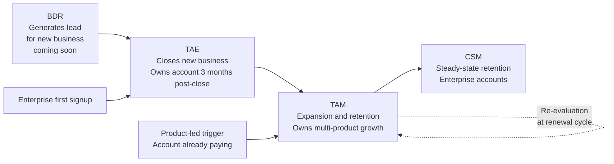

# Sales Structure and Compensation Model

This document maps the PostHog sales org structure, how each role operates, the leads each team can approach, how the compensation model works per role, and the structural gaps in the current model that the RevOps function will need to address.

All information is drawn directly from the PostHog public handbook. Where numbers or mechanics are inferred rather than explicitly stated, they are flagged.

## The Account Lifecycle

An account does not go through a single rep — it moves through different roles as it matures. The sequence below reflects the typical progression, though accounts can enter at different stages or skip steps depending on how they arrive.

Note: Product-led accounts — companies already paying via self-serve — go directly to a TAM without passing through a TAE. Large enterprise signups go directly to a TAE. The BDR generates leads only for the new business (TAE) motion.

The dotted loop on the TAM indicates that even after an account moves to CSM steady-state, it should be re-evaluated at each renewal cycle. Companies grow, teams expand, and new products are released. An account that had no expansion potential 12 months ago may have significant potential today.

## Role Definitions and Lead Sources

### TAE (Technical Account Executive)

**What they do:** Close new business from inbound and outbound leads. Expand customer usage in the first 12 months post-close.

**Leads they can approach:**
- Direct email to sales@posthog.com
- Demo form submissions from posthog.com/demo
- Product usage triggers for accounts not yet in a paid plan, supplemented by Clay enrichment
- BDR-generated cold outbound leads
- Enterprise first signups: companies with 500+ employees, at least 1 event ingested, and at least 1 person invited
- Startup credit burndown: used 50%+ of startup credits AND last invoice above $5K
- Startup plan roll-off: approaching end of startup credits with meaningful usage
- AE named lists: manually curated target accounts

**Minimum deal size:** $20K ARR. Below this, the TAE routes the account to self-serve.

**Post-close ownership:** 3 months after closing a prepaid contract, the TAE hands the account to a TAM or CSM. The TAE is responsible for ensuring the customer is well set up, not just that the contract is signed.

**Territory review:** Weekly standup. Random TAE selected for Salesforce hygiene check. Biweekly review of all opportunities above $50K.

### TAM (Technical Account Manager)

**What they do:** Expansion from existing paying customers. Close new business from product-led leads — accounts already paying via self-serve that meet routing criteria.

**Leads they can approach:**
- Accounts already paying with MRR between $500 and $1,667, 50+ employees, 7+ active users, in an ICP country, and paying for 3+ months
- Scale plan subscribers with high ICP score
- Accounts with MRR above $1K and forecasted spend growth above 50% in the current month
- Unmanaged accounts with above $20K ARR that raise a support ticket
- Manual referrals flagged with the `AM referral` segment in Vitally by any PostHog employee
- Accounts handed off from TAEs after the 3-month post-close period

**Leads they cannot approach:** New business from inbound or cold outbound. That is TAE and BDR territory.

**Book of business:** Up to 15 existing customer accounts. Hard cap of 25 including incoming product-led leads. At the end of each quarter, accounts are reviewed and some are handed off to bring the active list back to approximately 10.

**Book eligibility:** Only accounts with the `AM Managed` segment in Vitally count toward quota. This segment is added by the Revenue Leader after review, not by the TAM directly. Product-led leads are only added to the book for quota purposes if there is a concrete conversion plan in place.

**3-month grace period:** If a TAM inherits a new account and it churns in the first 3 months, it does not count against their quota.

**Handoff to CSM:** Before moving an account to CSM steady-state, the TAM must have exhausted expansion potential: attempted contact with all active users, assessed all cross-sell opportunities, and explored cross-team expansion within the customer organization. A difficult or negative customer is not a valid reason to hand off early.

**Re-evaluation at renewal:** Even after an account moves to CSM, it should be revisited at each renewal cycle. Companies grow, headcount increases, and new PostHog products are released. An account with no expansion potential today may become a meaningful expansion opportunity in 12 to 24 months. This re-evaluation is not formally documented in the handbook but is a logical operational practice that RevOps should build into the renewal cadence.

**Territory review:** Weekly standup. Random TAM selected to walk through each account: relationship rating, next step, and churn risk.

### CSM (Customer Success Manager)

**What they do:** Steady-state retention for enterprise accounts after the TAM has exhausted expansion potential.

**Leads they can approach:** Accounts handed off from TAMs after expansion potential has been fully assessed. Not responsible for generating new expansion — focused on retention and relationship management.

**Re-evaluation:** Same principle as TAM. At each renewal cycle, CSM should flag any accounts showing new growth signals for reassignment to a TAM for active expansion.

### BDR (Business Development Representative)

**Status:** Coming soon. The BDR role is documented in the compensation handbook and playbook but is not yet operationally active. The structure below reflects the intended design.

**What they do:** Generate leads for the new business team including cold outbound. Do not close deals — output is qualified opportunities for TAEs.

**Leads they work:**
- Engineering Managers (VPs, Directors, Heads of Engineering) who follow PostHog on LinkedIn but are not customers
- Website intent signals
- Competitor takeout campaigns
- High Stripe spenders with low PostHog MRR (backlog)
- Churned opportunities 5+ months old (backlog)
- Companies with recent fundraising activity (backlog)

**Output metric:** Sales Qualified Opportunities — accounts that reach Opportunity stage in Salesforce.

## Compensation Model

### OTE vs Quota

These are two different things that are often confused.

**OTE (On-Target Earnings)** is the total compensation a rep receives if they hit exactly 100% of their quota. It is the sum of base salary plus target commission. For a TAE with a 50/50 split, if OTE is $200K, the base is $100K and the target commission is $100K.

**Quota** is the sales target the rep must hit to earn the commission portion of OTE. It is set in dollars of ARR or number of SQOs depending on the role.

The two are related but independently set. Quota is derived from what the business needs the rep to sell. OTE is set based on what the market pays for that role. The ratio between them implies an expected commission rate per dollar sold.

Example: TAE with $200K OTE (50/50 split) and $1M annual quota earns $100K commission at 100% attainment, which is a 10% commission rate on quota. At 150% attainment ($1.5M sold), the commission is $150K — total comp is $250K, above OTE. The commission is uncapped and linear.

### TAE Compensation

| Element | Detail |
|---|---|
| OTE split | 50% base / 50% commission |
| Quota cadence | Set annually, divided by 4 |
| Commission structure | Uncapped, linear. 0% attainment = 0% commission. 100% = 100%. 200% = 200%. |
| Quota basis | Dollars invoiced — not credits, not face value of discounted deals |
| Ramp period | First 3 months: 100% OTE fixed regardless of attainment |
| Commission payout | Quarterly: end of January, April, July, October |
| Clawback | Commission subject to clawback if invoices remain unpaid. Overdue invoices excluded from payout, cutoff on the 14th of the month following the quarter. |

**What counts toward TAE quota:**
- Invoice payment on prepaid credit deals in the first 12 months
- Renewals: only the delta between the initial purchase and the renewal amount, not the full renewal value
- Monthly customers: ARR for the first 12 months while the TAE is primary account owner
- Multi-year contracts: normalized to the year 1 equivalent using the standard 1-year discount

**Performance floor (post-ramp):** Triggered if the TAE is under 80% of annual quota AND finishes two consecutive quarters under 70% of quarterly target.

### TAM Compensation

| Element | Detail |
|---|---|
| OTE split | 50% base / 50% commission |
| Quota basis | Additional usage ARR added to the book of business — invoiced usage growth, not contract value |
| Quota cadence | Set annually, divided by 4 |
| Commission structure | Uncapped, linear sliding scale — same mechanics as TAE. What differs: quota basis is usage ARR growth (not total invoiced value), and the cross-sell multiplier is applied to each invoice before it counts toward attainment — see below. |
| Ramp period | First 3 months: 100% OTE fixed. Expected to retain existing book and close at least one deal. |
| Commission payout | Quarterly: end of January, April, July, October |

**How TAM quota is measured:**

Interpreted directly from handbook: take Q1 usage ARR × 4, compare to Q2 usage ARR × 4. The difference is attainment toward quota.

This means:
- Growing a monthly customer's usage counts toward quota
- Expanding an annual customer beyond their contracted run rate counts — if a customer is on a $120K annual contract but being invoiced $20K/month, the TAM gets recognized on the additional $10K/month
- A customer reducing usage hurts the TAM's attainment — creating a built-in retention incentive
- Churn counts as $0 ARR in the quarter it occurs
- For new customers with fewer than 3 periods in the previous quarter, ARR is extrapolated from available invoices

**Cross-sell multiplier** ([source](https://posthog.com/handbook/growth/sales/how-we-work)):

Applied to each invoice based on how many primary products the customer is paying for. A product counts as paid if the invoice for that product exceeds $200.

Primary products: Product Analytics, Session Replay, Feature Flags, Surveys, Error Tracking, LLM Analytics (AI Observability), Managed Warehouse, CDP Destinations (Data Pipelines), Workflows, Logs, PostHog AI.

| Paid products | Multiplier |
|---|---|
| 1 | 0.7x |
| 2 | 0.9x |
| 3 | 1.1x |
| 4 | 1.3x |
| 5 | 1.5x |
| Each additional | +0.2x |

The base of 0.7x for single-product customers reflects higher churn risk. The multiplier incentivizes cross-sell as the primary expansion motion.

### BDR Compensation

| Element | Detail |
|---|---|
| OTE split | 70% base / 30% commission |
| Quota basis | Number of Sales Qualified Opportunities |
| Quota cadence | Set annually, divided by 4 |
| Commission structure | Uncapped, linear |
| Ramp period | Shorter than TAE/TAM, no guaranteed commission during ramp |
| Commission payout | Quarterly |

### Team Lead Compensation

| Element | Detail |
|---|---|
| OTE split | 60% base / 40% commission |
| Quota basis | Team quota attainment |
| Individual quota | Set lower to reflect management responsibilities |

Team quota calculation: fully ramped members contribute 100% of their individual quota to the team target. Members still in ramp contribute 50%.

## Operational Infrastructure

### Tools

**Salesforce:** Primary CRM. All deals, pipeline stages, opportunity values, and close dates. Territory reviews use Salesforce data directly.

**Vitally:** Customer success platform for TAMs and CSMs. Account health, usage signals, expansion triggers, and the `AM Managed` segment that determines which accounts count toward TAM quota.

**Sync gap:** Emails sent from Vitally require a manual BCC to appear in Salesforce. Customer communication history can be fragmented between the two systems if reps do not follow the BCC protocol consistently.

## Structural Gaps

**1. No real-time attainment visibility.**
There is no dashboard where a rep can see their current attainment, pipeline coverage, and projected commission at any point during the quarter. This is the most operationally urgent gap — reps are flying blind until the quarterly commission email arrives.

**2. No proactive underperformance detection.**
The current performance floor (under 80% annually AND two consecutive quarters under 70%) is a lagging indicator. By the time it fires, the rep has underperformed for two full quarters. A monitoring system that surfaces pipeline coverage gaps in the first 4 to 6 weeks of a quarter would allow intervention before the problem compounds.

**3. Commission attribution is ambiguous for PLG accounts.**
The TAE is commissioned on the full invoice value of the first 12 months. For accounts already paying $500 to $1,500/month via self-serve before the TAE touched them, a portion of that revenue would have arrived organically. The model does not separate the rep's incremental contribution from organic growth. This creates a compensation structure that may over- or under-reward reps relative to the actual value they created.

**4. The cross-sell multiplier creates the right incentive but no supporting data layer.**
The 0.7x to 1.5x+ multiplier correctly rewards TAMs for multi-product adoption. But there is no documented process for surfacing which accounts are single-product and which adjacent products are the most logical next sell. The RevOps layer needs to produce this view systematically from Salesforce and Vitally data.

**5. Quota setting methodology is undocumented.**
The handbook describes how commission is calculated once quota is set, but does not describe how quota is determined. What assumptions about deal size, win rate, and pipeline coverage go into the annual number? This is currently a judgment call made without a documented model — which makes it impossible to pressure-test or defend to the team.

## Sources

- [New business how we work](https://posthog.com/handbook/growth/sales/new-business-how-we-work) — TAE and BDR: OTE split, ramp, clawback, performance floor, lead sources
- [How we work (TAM)](https://posthog.com/handbook/growth/sales/how-we-work) — TAM: commission mechanics, cross-sell multiplier, book of business rules, team lead quota
- [Product-led sales](https://posthog.com/handbook/growth/sales/product-led-sales) — product-led lead handling and book eligibility
- [Expansion and retention](https://posthog.com/handbook/growth/sales/expansion-and-retention)
- [Lead routing and scoring](https://posthog.com/handbook/growth/sales/lead-scoring) — TAM routing thresholds
- [RevOps overview](https://posthog.com/handbook/growth/revops/overview)